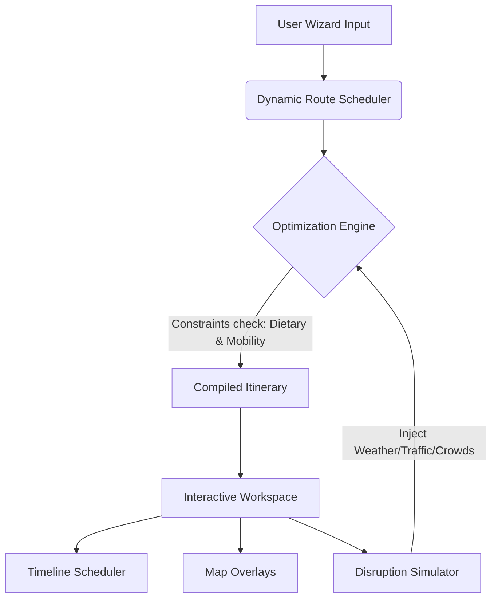

# 🗺️ Traverse Engine: Travel Planning & Experience Engine

Traverse Engine is a dual-platform premium **Travel Planning & Experience Engine** designed to construct dynamic, context-aware itineraries, simulate real-world travel disruptions, and re-optimize schedules in real time. 

The application is deployed and hosted on two environments:
*   🚀 **React (Vite + TS + Custom CSS) Web App:** Hosted on Vercel at [traverse-engine.vercel.app](https://traverse-engine.vercel.app)
*   🐍 **Python (Streamlit + PyDeck + Altair) App:** Hosted on Streamlit Community Cloud at [traverplanning-experienceengine.streamlit.app](https://traverplanning-experienceengine.streamlit.app/)

---

## 🌟 Key Capabilities & Features

### 1. Dynamic Route & Schedule Builder
*   **Context-Aware Scheduling:** Takes user preferences (destination, duration, budget class, travel pace, interests) and constraints (dietary requirements, mobility limitations) to structure a custom multi-day itinerary.
*   **Geographical Grouping:** Automatically groups hotels, breakfast/lunch/dinner venues, and morning/afternoon/evening sights geographically to minimize transit overhead.
*   **Smart Transit Estimation:** Dynamically selects the best travel mode (Walking, Subway, Taxi) and calculates time/cost estimations using the Haversine formula based on coordinates.

### 2. Live Trip Simulator & Alert Re-Optimizer
*   **Real-time Disruption Injection:** Simulates unpredictable real-world events:
    *   🌧️ **Heavy Rain:** Adjusts travel time, increases transit costs, and advises indoor alternatives.
    *   🚦 **Traffic Gridlock:** Adds delays to vehicle transits and recommends subway alternatives.
    *   👥 **Crowd Spikes:** Detects high-congestion alerts at sights and suggests swapping to quieter slots.
    *   🛡️ **Budget Shield:** Identifies if active daily spending has exceeded the targeted threshold limits and suggests cheaper alternatives or swaps.
*   **Adaptive Heuristics:** Features a heuristic engine that automatically shifts schedules or replaces activities when warnings are active.
*   **Live Console Log:** A scrollable developer console prints every evaluation step and routing decision made by the optimization engine.

### 3. Expense Analytics
*   **Cost Allocation Auditing:** An interactive Donut Chart visually graphs total travel expenses broken down into Lodging, Dining, Activities, and Transit.
*   **Budget Safety Indicators:** Compares active spending limits to current totals and issues dynamic warnings if budgets are overrun.

### 4. Interactive Maps
*   **React Vector Map:** Uses a custom SVG canvas to render map nodes, path lines, and an animated radar-tracker dot following the active simulation window.
*   **Streamlit PyDeck Map:** Uses high-resolution Mapbox dark-mode coordinates with Scatterplot layers for destinations and PathLayers to visualize the travel circuit.

### 5. Stamps Journal & Polaroid snapshots
*   **Daily Log:** Allows users to record journal memories for each travel day.
*   **Merit Stamp Board:** Evaluates user decisions and triggers achievements (e.g. *Storm Navigator*, *Thrift Commander*, *Tempo Runner*) as graphic stamp badge assets.

---

## 🛠️ Architecture & Project Structure

The project has two distinct frontend implementations powered by shared architectural principles:



### File Map
*   📁 **React / TypeScript Version (`src/`):**
    *   [`PlannerWizard.tsx`](file:///c:/Users/akank/TraverPlanning&ExperienceEngine/src/components/PlannerWizard.tsx): Wizard panel forms.
    *   [`ItineraryDashboard.tsx`](file:///c:/Users/akank/TraverPlanning&ExperienceEngine/src/components/ItineraryDashboard.tsx): Main day schedules.
    *   [`VectorMap.tsx`](file:///c:/Users/akank/TraverPlanning&ExperienceEngine/src/components/VectorMap.tsx): Custom SVG city routes canvas.
    *   [`RealTimeSimulator.tsx`](file:///c:/Users/akank/TraverPlanning&ExperienceEngine/src/components/RealTimeSimulator.tsx): Alert logs and disruption injection.
    *   [`ExpenseAnalytics.tsx`](file:///c:/Users/akank/TraverPlanning&ExperienceEngine/src/components/ExpenseAnalytics.tsx): Donut charts and spending safety boundaries.
    *   [`TravelJournal.tsx`](file:///c:/Users/akank/TraverPlanning&ExperienceEngine/src/components/TravelJournal.tsx): Stamps and polaroids.
*   📁 **Python / Streamlit Version:**
    *   [`app.py`](file:///c:/Users/akank/TraverPlanning&ExperienceEngine/app.py): Renders the sidebar settings, Pydeck charts, Altair donut, and tab systems.
    *   [`scheduler.py`](file:///c:/Users/akank/TraverPlanning&ExperienceEngine/scheduler.py): Core scheduler engine and alert re-routing algorithms.
    *   [`travel_db.py`](file:///c:/Users/akank/TraverPlanning&ExperienceEngine/travel_db.py): Static coordinate data models of attractions, lodging, and restaurants.

---

## 🚀 Running the Apps Locally

### 1. React Web App
```bash
# Install dependencies
npm install

# Run Vite dev server
npm run dev
```

### 2. Streamlit Python App
```bash
# Install packages
pip install -r requirements.txt

# Run local Streamlit server
streamlit run app.py
```
